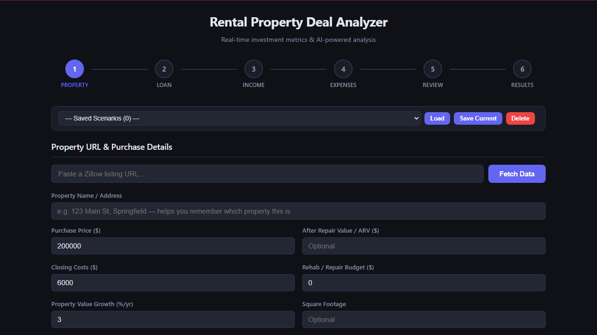

<div align="center">

# Rental Property Deal Analyzer

**Know if it's a good deal — before you buy.**

Free, open-source rental property investment calculator with AI-powered analysis.


[**Try the Live Demo**](https://rental-property-deal-analyzer.onrender.com) · [**Run Locally for Full Features**](#quick-start)

<a href="https://buymeacoffee.com/bkapu"></a>
<a href="https://github.com/sponsors/berkcankapusuzoglu"></a>

</div>

<br>

<div align="center">
  
  <br>
  <em>One click from empty form to full investment analysis</em>
</div>

<br>

## What You Get

- **20+ investment metrics** calculated instantly (CoC, Cap Rate, DSCR, NOI, GRM, and more)
- **AI-powered analysis** — free local models or Claude API
- **Point-based deal scorecard** — 14-point system with factor-by-factor reasoning
- **5-year total return breakdown** — Cash Flow + Appreciation + Debt Paydown + Tax Benefits
- **Strategy fit analysis** — Cash Flow / Wealth Building / Low Risk / BRRRR
- **Save, compare, and export** — localStorage scenarios, side-by-side comparison (up to 3), PDF + HTML export
- **Zillow & Redfin scraping** — auto-fill property data from a listing URL
- **Neighborhood Search** — search a zip code or city, score listings by investor metrics, then analyze the best ones
- **Sensitivity analysis** — what-if tables for interest rate, vacancy, rent, and purchase price
- **Rent estimation** — scrape Redfin rental listings to estimate market rent for any location
- **Mortgage rate auto-fill** — fetch current 30-year fixed rate from Freddie Mac with one click
- **Deal alerts & CSV export** — highlight matching listings, export search results to spreadsheet
- **Model selector** — switch between AI models on the fly

## Quick Start

### 1. Install

```bash
pip install -r requirements.txt
python -m playwright install chromium
```

### 2. Configure AI (optional)

```bash
cp .env.example .env
```

Choose your AI provider:

| Provider | Speed | Quality | Cost | Setup |
|----------|-------|---------|------|-------|
| **LM Studio** + qwen3.5-4b | ~30s | Excellent | Free | [Download LM Studio](https://lmstudio.ai) + load model |
| **LM Studio** + liquid/lfm2.5-1.2b | ~6s | Good | Free | [Download LM Studio](https://lmstudio.ai) + load model |
| **Ollama** + llama3.2:3b | ~7s | Good | Free | `ollama pull llama3.2:3b` |
| **Anthropic Claude** | ~5s | Excellent | ~$0.01/query | Set `ANTHROPIC_API_KEY` in `.env` |

**LM Studio** (recommended for GPU acceleration — works with AMD + NVIDIA via Vulkan):
```bash
AI_PROVIDER=lmstudio
```

**Ollama** (free, local):
```bash
AI_PROVIDER=ollama
OLLAMA_MODEL=llama3.2:3b
```

**Anthropic Claude** (paid, highest quality):
```bash
AI_PROVIDER=anthropic
ANTHROPIC_API_KEY=sk-ant-your-key-here
```

### 3. Run

```bash
python app.py
```

Opens automatically at **http://localhost:8000**. No build step required.

### Environment Variables

| Variable | Default | Description |
|----------|---------|-------------|
| `AI_PROVIDER` | `auto` | `auto`, `lmstudio`, `ollama`, or `anthropic` |
| `LMSTUDIO_URL` | `http://localhost:1234` | LM Studio server URL |
| `LMSTUDIO_MODEL` | _(auto)_ | Model ID from LM Studio |
| `OLLAMA_URL` | `http://localhost:11434` | Ollama server URL |
| `OLLAMA_MODEL` | `llama3.2:3b` | Any Ollama model name |
| `ANTHROPIC_API_KEY` | — | Required for Anthropic provider |

## How It Works

The app has three modes, toggled on the first step:

### Single Property (default)

A **6-step wizard** for analyzing a specific property:

1. **Property Info** — Address, price, type, ARV, rehab budget (or paste a Zillow/Redfin URL)
2. **Financing** — Down payment, rate, term, points, closing costs (or toggle cash purchase). Click **Current Rate** to auto-fill the latest 30-year fixed mortgage rate from Freddie Mac.
3. **Income** — Monthly rent (multi-unit support), other income, growth rate. Click **Estimate Rent** to scrape Redfin rental listings and get market rent stats (low, median, average, high).
4. **Expenses** — Taxes, insurance, HOA, utilities, percentage-based costs, expense growth
5. **Review** — Summary of all inputs before calculating
6. **Results** — Full dashboard with metrics, projections, sensitivity analysis, charts, and AI analysis

### Neighborhood Search

Search a zip code or city to **discover** deals — enter a location and target rent, get a scored table of listings, then click **Analyze →** on any result to jump into the full wizard with data pre-filled. See the [Neighborhood Search](#neighborhood-search) section below for details.

### Smart Deal Finder

Fully automated deal discovery — enter a location and the app will:
1. Scrape Redfin rental listings to auto-detect market rents
2. Calculate a smart price cap based on median rent (see [Smart Price Cap](#smart-price-cap))
3. Search for-sale listings under that cap
4. Score each listing with a [6-star Quick Score](#quick-score-6-stars) using estimated rent
5. Show all results ranked by deal quality

> **Note:** Neighborhood Search and Smart Deal Finder require **running locally** — Redfin blocks requests from cloud servers. The [live demo](https://rental-property-deal-analyzer.onrender.com) supports Single Property mode with manual entry and the "Try Example Deal" button.

## Metrics Reference

### Core Metrics

| Metric | What It Means | Good Target |
|--------|---------------|-------------|
| **Monthly Cash Flow** | Rent minus ALL expenses (operating + mortgage) | > $100-200/unit |
| **Cash-on-Cash Return** | Annual cash flow / total cash invested | > 8% |
| **Cap Rate** | NOI / purchase price (financing-independent) | > 5-6% |
| **DSCR** | NOI / annual mortgage (debt coverage) | > 1.25 |
| **GRM** | Purchase price / annual rent | < 12-15 |
| **Break-Even Occupancy** | Min occupancy to cover all costs | < 85% |
| **OER** | Operating expenses / gross income | < 50% |
| **Annual Depreciation** | Building value / 27.5 years (IRS schedule) | Informational |

### The Four Pillars of Return

Real estate returns come from four sources, all calculated over a 5-year projection:

| Pillar | What It Is |
|--------|-----------|
| **Cash Flow** | Net rental income after all expenses and mortgage |
| **Appreciation** | Property value growth over time |
| **Debt Paydown** | Principal reduction — tenants pay down your loan |
| **Tax Benefits** | Depreciation deduction x your marginal tax rate |

### Deal Scorecard (14-Point System)

| Metric | 2 pts (Strong) | 1 pt (OK) | 0 pts (Weak) |
|--------|---------------|-----------|--------------|
| CoC Return | >= 8% | >= 4% | < 4% |
| Cap Rate | >= 6% | >= 4% | < 4% |
| DSCR | >= 1.25 | >= 1.0 | < 1.0 |
| CF per Unit/mo | >= $200 | >= $100 | < $100 |
| Break-even Occ. | <= 75% | <= 85% | > 85% |
| 1% Rule | Pass (2pts) | — | Fail (0pts) |
| 50% Rule | Pass (2pts) | — | Fail (0pts) |

**Verdict:** >= 75% = Great Deal | >= 45% = Borderline | < 45% = Pass

### Rules of Thumb

| Rule | Formula | Purpose |
|------|---------|---------|
| **1% Rule** | Monthly rent >= 1% of price | Quick cash flow filter |
| **50% Rule** | Operating expenses ~ 50% of rent | Expense reality check |
| **70% Rule** | Price + rehab <= 70% of ARV | BRRRR / flip viability |

### Strategy Fit

| Strategy | Key Metrics | What Makes It Work |
|----------|-------------|-------------------|
| **Cash Flow** | CoC >= 8%, CF/unit >= $200, DSCR >= 1.25 | High rent-to-price, low expenses |
| **Wealth Building** | 5yr total return, appreciation, equity growth | Growing markets, value-add |
| **Low Risk** | BEO < 75%, DSCR >= 1.5, 50% rule pass | Conservative margins |
| **BRRRR** | 70% rule pass, ARV spread | Below-market purchase + forced appreciation |

### Sensitivity Analysis

The results page includes **4 what-if tables** showing how key metrics change under different assumptions:

| Table | Variable | Range | Metrics Shown |
|-------|----------|-------|---------------|
| **Interest Rate** | ±2% from your rate | 5 steps | Monthly Cash Flow, CoC Return |
| **Vacancy Rate** | ±5% from your assumption | 5 steps | Monthly Cash Flow, Break-even Occupancy |
| **Rent Change** | ±10% | 5 steps | Monthly Cash Flow, CoC Return |
| **Purchase Price** | ±10% | 5 steps | Cap Rate, CoC Return |

The current (base) values are highlighted. This helps you stress-test deals — if the deal only works at exactly 5% vacancy and 6% rates, it may be riskier than one that survives 10% vacancy and 8% rates.

## Example Scenarios

### Good Deal — Cash Flow Rental

| | |
|---|---|
| **Property** | $250,000 single family, $2,800/mo rent |
| **Results** | Cash Flow: **$593/mo** · CoC: **9.83%** · Cap Rate: **8.92%** · DSCR: **1.47** |
| **Score** | **14/14 — Great Deal** |
| **5-Year Return** | **$104,189** (143.71% on $72,500 invested, 19.50% CAGR) |

### Mediocre Deal — Suburban, Thin Margins

| | |
|---|---|
| **Property** | $380,000 single family, $2,400/mo rent |
| **Results** | Cash Flow: **-$250/mo** · CoC: **-3.5%** · Cap Rate: **~4.7%** · DSCR: **~0.87** |
| **Score** | **~4-5/14 — Borderline** |
| **5-Year Return** | Positive (appreciation + debt paydown offset negative CF) |

### Bad Deal — Overpriced, Negative Cash Flow

| | |
|---|---|
| **Property** | $500,000, $2,000/mo rent (0.4% rule — far below 1%) |
| **Results** | Cash Flow: **-$1,690/mo** · CoC: **-17.6%** · DSCR: **~0.40** · BEO: **~176%** |
| **Score** | **2/14 — Pass** |
| **Why** | Mortgage alone ($2,797/mo) exceeds rent. Unsustainable. |

## Assumptions & Defaults

| Assumption | Default | Notes |
|-----------|---------|-------|
| Building value % | 80% | IRS land/building split for depreciation |
| Depreciation | 27.5 years straight-line | IRS residential schedule |
| Marginal tax rate | 25% | Adjust to your bracket |
| Vacancy | 8% | National avg 5-8% |
| Maintenance | 5% | Older properties may need 8-10% |
| CapEx reserve | 5% | Major replacements fund |
| Management | 10% | Set 0% if self-managing |
| Closing costs | 3% of price | Varies by state (1-5%) |
| Value growth | 3%/yr | U.S. historical avg |
| Income growth | 2%/yr | Conservative rent increases |
| Expense growth | 2%/yr | Roughly tracks CPI |
| Loan terms | 30yr fixed, 20% down, 7% | Click "Current Rate" for live Freddie Mac rate |

**Not accounted for:** selling costs (6-8%), capital gains tax, depreciation recapture (25%), cost segregation, refinancing, PMI, rent-ready costs, legal/accounting fees.

## Tech Stack

- **Backend:** Python, FastAPI, uvicorn, httpx, BeautifulSoup, Playwright
- **Frontend:** Vanilla HTML/CSS/JS (single file, no frameworks, no build step)
- **AI:** LM Studio (free, GPU) / Ollama (free, local) / Anthropic Claude (paid, cloud)

## Property Data Scraping

The app can auto-fill property data from **Redfin** and **Zillow** listing URLs.

| Source | Reliability | Notes |
|--------|-------------|-------|
| **Redfin** | High | Extracts price, beds, baths, sqft, year built, description, and photo from structured ld+json data |
| **Zillow** | Low | Aggressively blocked by PerimeterX/HUMAN bot detection; may fail even with Playwright fallback |

The scraper tries httpx first, then Playwright headless Chromium as fallback. When scraping fails, enter data manually — all fields are editable.

### Additional Data Sources

| Feature | Source | Notes |
|---------|--------|-------|
| **Mortgage Rate** | [Freddie Mac PMMS](https://www.freddiemac.com/pmms) | Current 30-year fixed rate, cached 6 hours |
| **Rent Estimates** | Redfin rental listings | Scrapes active rentals via Playwright, returns percentile stats |
| **Neighborhood Search** | Redfin search API | Structured JSON from `stingray/api/gis` endpoint |

---

## Neighborhood Search

Search an entire zip code or city to **discover** investment deals — not just analyze ones you already know about.

### How It Works

1. Click **Neighborhood Search** on Step 1 (the toggle next to "Single Property")
2. Enter a **location** (zip code like `78701` or city like `Austin, TX`)
3. Enter your **target monthly rent** for the area (what you'd charge a tenant)
4. Optionally set filters: price range, min beds, property type
5. Click **Search Listings** — the app loads Redfin's search page and extracts all active listings
6. Results appear in a sortable table with a **Quick Score** for each listing
7. Click **Analyze →** on any listing to switch to the full single-property wizard with data pre-filled

### Search Filters

| Filter | Required | Default | Notes |
|--------|----------|---------|-------|
| Location | Yes | — | Zip code (e.g. `78701`) or city + state (e.g. `Austin, TX`) |
| Min Price | No | None | Set a floor to skip low-quality inventory |
| Max Price | No | None | Your budget cap |
| Min Beds | No | Any | Investors typically want 2+ bedrooms |
| Property Type | No | Any | House, Condo/Townhouse, or Multi-family |
| Target Monthly Rent | Yes | — | Your rent estimate for the area (used for scoring) |
| Max Results | No | 20 | 10, 15, 20, or 25 |

### Quick Score (6 Stars)

Each listing is scored on six investor checks, aligned with the full [14-point scorecard](#deal-scorecard-14-point-system) so high quick scores reliably predict good full-analysis results:

| Check | ★ Condition | What It Tells You |
|-------|-------------|-------------------|
| **Est. Cap Rate** | >= 6% | Decent return after estimated expenses |
| **Est. DSCR** | >= 1.25 | NOI comfortably covers debt service |
| **Est. Cash Flow** | >= $100/mo | Positive cash flow after mortgage |
| **1% Rule** | rent/price >= 1% | Rent high enough relative to price |
| **GRM** | <= 12 | Low price relative to annual rent |
| **Est. Total Return** | >= 10% yr1 | Strong combined return (CF + appreciation + equity) |

Stars are color-coded: **5-6 = green** (strong deal), **3-4 = yellow** (borderline), **1-2 = red** (weak), **0 = gray** (doesn't pass any check). Each check also has a numeric score (0-100) for ranking.

> **Why "Target Monthly Rent" on Neighborhood Search?** You know your market — Smart Deal Finder auto-estimates rent, but Neighborhood Search lets you set it manually for more control.

### Analyze → Full Wizard

When you click **Analyze →** on a search result:

1. The app switches to **Single Property** mode
2. The Redfin listing URL is set and a full scrape runs automatically
3. Price, address, sqft, and dependent fields (closing costs, insurance) are pre-filled
4. You continue through the 6-step wizard as normal — add loan details, rent, expenses, then get full results

### Deal Alerts

Click **Deal Alerts** in the toolbar above search results to set thresholds:

| Filter | Default | What It Does |
|--------|---------|-------------|
| Min Stars | 2+ | Only highlight listings with this many quick score stars |
| Max Price | — | Budget cap |
| Min Beds | — | Minimum bedrooms |

Listings that match all criteria get a green **"Match"** badge and highlighted row. Preferences are saved to localStorage.

### Export CSV

Click **Export CSV** to download all search results as a spreadsheet with columns: Address, Price, Beds, Baths, Sqft, Quick Score, 1% Rule, Est. Cap Rate, Est. Cash Flow, and Listing URL.

### Saved Filters

Search filters (location, price range, beds, property type, rent, max results) are automatically saved to localStorage and restored when you return.

### Rate Limits

Neighborhood Search is limited to **3 searches per minute** to avoid overloading Redfin. If you hit the limit, wait 60 seconds and try again.

### Smart Price Cap

Smart Deal Finder calculates a maximum property price from median market rent to focus on listings that could actually pencil out as investments. The formula is:

```
smart_max_price = median_rent × 250    (rounded up to nearest $25K, min $75K)
```

The multiplier (250) corresponds to a GRM of ~20.8 — the upper bound of "worth analyzing" for rental investments. Here's how different multipliers translate:

| Multiplier | Implied Rent/Price | GRM | Example ($1,127 median rent) |
|---|---|---|---|
| 100 | 1.00% | 8.3 | $112,700 (strict 1% rule) |
| 150 | 0.67% | 12.5 | $169,050 |
| 200 | 0.50% | 16.7 | $225,400 |
| **250** | **0.40%** | **20.8** | **$281,750 (current default)** |
| 300 | 0.33% | 25.0 | $338,100 |

At current ~6-7% mortgage rates, almost nothing meets the 1% rule. The 250 multiplier balances showing enough listings to find deals while filtering out properties where the numbers can never work. Properties above this cap are almost certainly negative cash flow with no path to viability.

> **To change the multiplier:** Edit `smart_max_price = int(best_rent * 250)` in `app.py` (search for "smart_max_price"). Lower = stricter filtering, higher = more results.

### Known Limitations

- **Redfin only** — Zillow blocks automated search pages too aggressively
- **Cloud servers blocked** — Redfin blocks datacenter IPs; search features require running locally
- **No map view** — results are table-only for now
- **One search at a time** — no batch analysis of multiple listings simultaneously
- **City search** requires Redfin to recognize the city name — use zip codes for best reliability

---

## Support the Project

If this tool helped you evaluate a deal, consider supporting its development:

<a href="https://buymeacoffee.com/bkapu">
  
</a>

Your support helps keep this project free and actively maintained.

---

## Contributing

See [CONTRIBUTING.md](CONTRIBUTING.md) for how to run locally and submit PRs.

## License

[MIT](LICENSE) — free to use, modify, and distribute.
