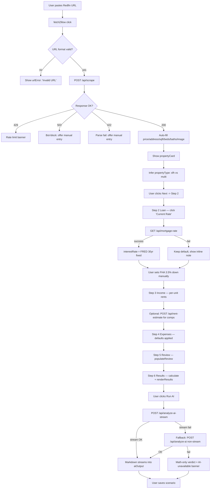
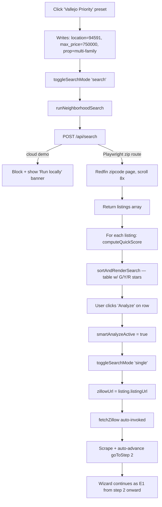

# USER_FLOW.md — Rental Property Deal Analyzer (Jose's Vallejo FHA Build)

**Version**: 1.0
**Date**: 2026-04-17
**Author**: Workflow Architect
**Status**: Draft (pre-customization baseline + Jose-specific overlays)
**Repository root**: `/Users/hilarioo/Documents/Projects/Rental-Property-Deal-Analyzer/`
**Worktree**: `.claude/worktrees/lucid-hertz-aad76c/`
**Primary sources**:
- `app.py` (2,102 lines — FastAPI backend, scraper, rent estimator, AI router)
- `index.html` (4,221 lines — SPA with 6-step wizard, Neighborhood Search, scenarios)
- Local dev server: `http://localhost:8000`

---

## 0. Reader Orientation

This document maps every user-visible path through the Deal Analyzer for **Jose — first-time FHA owner-occupant buyer targeting 2–4 unit properties in Vallejo, CA, with $85K cash, $54K W-2 income, 780 FICO, $0 debt**. It covers:

1. **Entry points** (4 discovery paths)
2. **Happy paths** (single-URL and preset-driven)
3. **Branch & failure modes** (12 identified)
4. **Decision points** (5 Jose-critical gates)
5. **Handoff contracts** (4 FE<->BE API edges + 1 internal FE contract)
6. **Observable states** (loading, error, success, empty)
7. **Session lifecycle** (localStorage behavior, reload semantics)

The base tool is generic — every section flags where **Jose-specific customizations** overlay the base flow. Those customizations are labeled `[JOSE-OVERLAY]`.

---

## 1. Entry Points

Jose can enter a session through four doors. Each lands him in a different wizard state and triggers different downstream fetches.

| # | Entry | Triggered by | Lands at | Pre-fill source |
|---|---|---|---|---|
| E1 | **Cold URL paste** | Paste Redfin/Zillow URL into Step 1 `zillowUrl` input, click "Fetch Data" | Step 1 (Property) — auto-fills, offers "Next" | `/api/scrape` response |
| E2 | **Preset-driven discovery** `[JOSE-OVERLAY]` | Click "Vallejo Priority" / "East Bay Nearby" / "Richmond Motivated Sellers" preset button in Neighborhood Search mode | Neighborhood Search panel — listings table populated with quick scores | Preset writes into `searchLocation`, `searchMinPrice`, `searchMaxPrice`, `searchPropType` then calls `runNeighborhoodSearch()` |
| E3 | **Saved scenario load** | Open `scenarioSelect` dropdown on Step 1, click "Load" | Step 1 (Property) with every `SAVE_FIELDS` field rehydrated, `calculate()` fired, `lastCalcResults` populated | `localStorage['rpda_scenarios'][name]` |
| E4 | **Manual entry** | Toggle "Single Property" mode, ignore URL row, type `purchasePrice` directly, click "Next" | Step 1 with only `purchasePrice` populated | User keystrokes |

Entry point E2 is the **primary Jose flow** — he does not prospect one listing at a time, he sweeps a zip, ranks, then analyzes the top 2–3.

### Mode Toggle State Machine

```
       ┌──────────────────── singlePropertyMode (default)
appMode┤
       ├──────────────────── searchMode (Neighborhood Search)
       └──────────────────── smartMode (Smart Deal Finder)
```

- Controlled by `toggleSearchMode(mode)` — `index.html:2211-2224`
- `appMode` variable — `index.html:1935`
- Smart mode calls `/api/smart-search` (`app.py:979`); Neighborhood calls `/api/search` (`app.py:946`)
- `[JOSE-OVERLAY]` Preset buttons live inside the Neighborhood Search panel (`searchMode`), so clicking a preset implies `toggleSearchMode('search')` first.

---

## 2. Happy Path — Single URL Analysis (E1)

Jose pastes one Redfin URL for a Vallejo duplex and walks the wizard end-to-end. This is the flow used for test case TC-01.

### 2.1 Flowchart



### 2.2 Step-by-Step State Transitions

| Step | User action | Fields that change | Computed | Displayed | Latency |
|---|---|---|---|---|---|
| 1a | Paste URL, click "Fetch Data" | `zillowUrl` | — | Spinner in `fetchBtnText`, button disabled (`index.html:2085-2086`) | — |
| 1b | Scrape succeeds | `purchasePrice`, `closingCosts` (3% of price), `insurance` (0.5% of price), `monthlyRent` (if `rentZestimate`), `propertyTaxes`, `hoa`, `sqft`, `propName`, `propertyType` | auto-fill flags set (`autoFilledFields`) | `propertyCard` visible w/ image, address, beds/baths/sqft | 500ms–1s (httpx) / 3–8s (Playwright) |
| 1c | Click "Next" | `currentStep = 2`, `maxVisitedStep = 2` | `validateStep(1)` requires price > 0 | Step 2 panel active; wizard circle turns green | <16ms |
| 2a | Click "Current Rate" | — | — | Spinner in `fetchRateBtn` | — |
| 2b | Rate fetch succeeds | `interestRate` (e.g., 6.30) | — | Field populated, button returns to "Current Rate" | <1s (cached) |
| 2c | Jose sets `downPayment = 3.5`, keeps `loanTerm = 30` | `downPayment` | — | "Down payment helper" under field (`updateDpHelper()`) | — |
| 3 | Enter `monthlyRent` per unit (SFH flow) or unit inputs (multi) | `monthlyRent`, `otherIncome` | — | Field totals | — |
| 4 | Review expense defaults (maintenance 5%, vacancy 5%, capex 10%, management 8%) | any overrides | — | Field values | — |
| 5 | Click "Next" | `currentStep = 5` | `populateReview()` renders read-only summary | Review panel | — |
| 6 | Auto-fires on step entry | `lastCalcResults` object populated | `calculate()` runs full math (`index.html:3100-3352`); `renderResults()` paints DOM | PITI, CF, CoC, cap rate, DSCR, G/Y/R verdict | <50ms |
| 7 | Click "Run AI" | — | — | Spinner in `aiBtn`, streaming text in `aiOutput` | 5–10s (Claude Sonnet 4) |

### 2.3 `calculate()` → `renderResults()` contract

`calculate()` at `index.html:3096-3353` MUST populate `lastCalcResults` with at minimum:

```js
{
  price, arv, closingCosts, rehab,
  isCash, dpPct, dpAmount, rate, termYears, loanAmount,
  totalRent, otherIncome, totalMonthlyIncome,
  monthlyPI,     // index.html:3131-3138
  piti,          // index.html:3142
  totalOpex,     // index.html:3149
  monthlyCF,     // index.html:3152
  annualCF, noi, totalCashInvested, totalCashClose,
  coc, capRate, grm, breakeven, dscr,
  onePercentPass, onePercentPct, fiftyPctRatio,
  show70, seventyPctPass, annualized5yrROI,
  dealGrade,     // 'great' | 'borderline' | 'pass'  — index.html:3307-3320
  dealText,      // 'Great Deal' | 'Borderline Deal' | 'Pass on This Deal'
  dealExpl,      // "X/Y points — reason"
  dealFactors,   // array of {name, value, verdict, reason}
  dealPoints, dealMaxPoints,
  sqft, pricePerSqft, pricePerUnit, rentPerSqft,
  monthlyCFPerUnit, oer, unitCount,
  annualDepreciation, annualTaxSavings, afterTaxCF,
  totalReturnCF, totalReturnAppreciation, totalReturnDebtPaydown,
  totalReturnTaxBenefits, totalReturn5yr,
  projRows, amortSchedule, monthlyRate, propertyType, n
}
```

If any of `{piti, monthlyCF, coc, capRate, dealGrade, dealText, totalCashClose}` is missing, `renderResults()` at `index.html:3397` will paint `--` or throw. **That is a test-case gate**: `expect(lastCalcResults.piti).toBeGreaterThan(0)` for any non-cash deal.

### 2.4 `[JOSE-OVERLAY]` fields to add at Step 6

The base tool does NOT currently compute:

| Field | Jose definition | Where it belongs |
|---|---|---|
| **FHA MIP monthly** | Annual MIP 0.55% of loan balance / 12 | Add to `piti` after line `3142` as `piti = monthlyPI + monthlyTaxes + monthlyInsurance + monthlyMIP` |
| **FHA UFMIP (upfront)** | 1.75% of loan amount, rolled into loan OR paid at close | Add to `totalCashInvested` at `3160` |
| **75% rental offset** | 0.75 × (gross market rent of non-owner units) counted as qualifying income | Used in DTI calc (new metric) |
| **Net PITI (after offset)** | `piti - (0.75 × otherUnitRent)` | New metric, drives RED gate at $3,200 ceiling |
| **Qualifying income** | `monthlyW2 + 0.75 × otherUnitRent` | Drives DTI |
| **DTI ratio** | `(piti + monthlyDebt) / qualifyingIncome` | Hard gate — FHA ceiling 43% (Jose has $0 debt so headroom is large) |

All six must be added to `lastCalcResults` and surfaced in `renderResults()` before the spec is complete.

---

## 3. Happy Path — Preset-Driven Discovery (E2)

This is Jose's daily-driver flow: sweep a zip, rank the table, analyze the top pick.

### 3.1 Flowchart



### 3.2 Preset Definitions `[JOSE-OVERLAY]`

Presets do not exist in the base code yet — this is net-new. The contract:

| Preset button | Writes to form | G/Y/R zip classification |
|---|---|---|
| **Vallejo Priority** | `location=94591`, `min_price=null`, `max_price=750000`, `property_type=multi-family`, `max_results=40` | 94591, 94589, 94590 → PRIORITY (green boost) |
| **East Bay Nearby** | `location=94565` then sequentially 94553, 94520 (chain 3 searches) | These zips → SECONDARY (neutral) |
| **Richmond Motivated Sellers** | `location=94801`, `max_price=650000`, sort=price-asc | 94801 motivated band → SECONDARY (neutral) |

Excluded zips — listings from these MUST be flagged with a warning row and an "exclude this" toggle:

- **94803** (Point Richmond) — overpriced for rent-to-value
- **94806** (Hilltop) — insurance burden
- Oakland zips (94601-94621) — rent control complexity
- Berkeley zips (94702-94710) — rent control + price

### 3.3 Quick Score vs Full Scorecard

Quick score lives at `index.html:2294` (`computeQuickScore`). It uses **tiered expense ratios** already aligned to the full scorecard thresholds (see commit `89ac943`):

| Price band | Expense ratio | Source |
|---|---|---|
| >= $250K | 45% | `index.html:2308` |
| $100K–$250K | 50% | `index.html:2308` |
| < $100K | 55% | `index.html:2308` |

The quick score is a **ranking heuristic**, not a decision. When Jose clicks "Analyze" on a row, the full `calculate()` at `index.html:3100` runs with his actual financing assumptions. These can and will diverge — e.g., quick score assumes 20% down & 7% rate, full calc reflects FHA 3.5% down and `fetchMortgageRate()` live rate.

---

## 4. Branch Conditions & Failure Modes

Every async boundary can fail. Below is the matrix.

### 4.1 Scrape Fallback Chain (`/api/scrape`)

```
User URL
  │
  ▼
┌──────────────────────────────────┐
│ Step 0: URL validation            │ app.py:1398-1423
│   - empty? 400                    │
│   - len > 2000? 400               │
│   - hostname not Redfin/Zillow?   │
│     400 "Unsupported URL"         │
│   - Redfin path !~ /home/\d+?400  │
│   - Zillow path !~ /homedetails/? │
│     400                           │
└──────────────────────────────────┘
  │ pass
  ▼
┌──────────────────────────────────┐
│ Step 1: httpx GET (20s timeout)   │ app.py:1430-1438
│   - HTTP >= 400? → next           │
│   - "captcha" in first 2KB? →next │
│   - "access denied" in 3KB? →next │
│   - else → HTML acquired          │
└──────────────────────────────────┘
  │ fail
  ▼
┌──────────────────────────────────┐
│ Step 2: Playwright headless       │ app.py:1441-1448
│   - _fetch_with_playwright        │
│   - still bot-blocked? → 503      │
│   - exception? → 503              │
└──────────────────────────────────┘
  │ pass
  ▼
┌──────────────────────────────────┐
│ Step 3: BeautifulSoup parse       │ app.py:1457-1463
│   - lxml crash? → 422             │
└──────────────────────────────────┘
  │ pass
  ▼
┌──────────────────────────────────┐
│ Step 4: CAPTCHA re-check on soup  │ app.py:1466-1472
│   - captcha-container? → 503      │
└──────────────────────────────────┘
  │ pass
  ▼
 ┌─────────────┐     ┌────────────────────────┐
 │ redfin?     │──Y─▶│ _extract_redfin        │ app.py:502, called 1476
 └─────────────┘     │   - fail? 422 "couldn't│
        │ N          │     extract"           │
        ▼            └────────────────────────┘
 ┌────────────────────────────────────┐
 │ Zillow 3-tier fallback             │
 │ 1) _extract_from_next_data         │ app.py:167, called 1485
 │    - __NEXT_DATA__ script present? │
 │    - if yes → return               │
 │ 2) _extract_from_ld_json           │ app.py:273, called 1489
 │    - <script type=ld+json> present?│
 │    - if yes → return               │
 │ 3) _extract_from_dom               │ app.py:337, called 1493
 │    - CSS selector fallback         │
 │    - if yes → return               │
 │ else → 422 "Could not extract"     │
 └────────────────────────────────────┘
```

### 4.2 Branch Matrix (Scrape)

| Condition | Detected at | HTTP | User-visible state | Recovery |
|---|---|---|---|---|
| Empty URL | FE `fetchZillow` (`index.html:2073`) | — | Inline `urlError` | Re-enter URL |
| Non-http(s) or non-Redfin/Zillow host | FE `fetchZillow` + BE `_detect_source` | 400 | Inline `urlError` "Invalid URL" | Paste correct URL or switch to manual |
| Zillow path lacks `/homedetails/` | BE `app.py:1414-1418` | 400 | `urlError` with message | — |
| Redfin path lacks `/home/\d+` | BE `app.py:1419-1423` | 400 | Same | — |
| Rate limit exceeded (>5 req/min) | BE `_check_rate_limit` (`app.py:1391`) | 429 | `urlError` "Too many requests" | Wait 60s |
| httpx timeout >20s | BE `app.py:1437` (`httpx.RequestError`) | — | Silent, cascades to Playwright | — |
| Playwright Chromium crash | BE `app.py:1447` | 503 | `urlError` "Could not fetch... try manually" | E4 manual entry |
| Zillow PerimeterX wall | BE detects "access denied" text | 503 | Same message | E4 manual entry |
| `__NEXT_DATA__` absent | BE `_extract_from_next_data` returns None | — | Silent, cascades to ld+json | — |
| ld+json absent | BE `_extract_from_ld_json` returns None | — | Silent, cascades to DOM | — |
| DOM selectors yield partial (no price) | BE `_extract_from_dom` returns None | 422 | "Could not extract property data" | Redfin URL or manual |
| Network failure FE->BE | FE `catch` block (`index.html:2179-2186`) | — | `connectionBanner` + `urlError` | Check server running |

### 4.3 Mortgage Rate Fetch

| Condition | Behavior | Recovery |
|---|---|---|
| FRED API reachable, fresh | `interestRate` populated with live value (6.3% as of date) | — |
| FRED API down / timeout | `/api/mortgage-rate` returns `{rate: null, error: ...}` | Field retains prior value (default 7.0); user can type manually |
| Rate stale (cache >24h) | `_ensure_mortgage_rate()` re-fetches; if fail, serves stale | Inline note "Rate last updated X ago" (to be added) |

### 4.4 Rent Estimate

| Condition | Behavior | Recovery |
|---|---|---|
| <3 comps returned | BE returns `{rentals, stats}` with low `count`; FE MUST show "⚠ Only N comps — estimate may be unreliable" | Accept with warning OR type manual rent |
| Zero rentals | BE `{rentals: [], total: 0}` | FE shows "No comps found. Enter rent manually." |
| Playwright Redfin blocked | BE returns `{error: "Could not connect..."}` status 404 | Manual rent entry |
| Rate-limited (>3 req/min) | 429 | Wait 60s |

### 4.5 AI Analysis

| Condition | Detection | User-visible | Recovery |
|---|---|---|---|
| No provider configured | BE `app.py:1672-1676` returns 400 | Banner: "No AI provider configured. Set ANTHROPIC_API_KEY or run Ollama." | Ignore — math-only results still display |
| Anthropic API rate-limited / 5xx | BE `app.py:1686-1690` wraps exception, returns 502 | Banner with error text | Retry button; results still show |
| Anthropic network failure | BE catches `httpx.RequestError` (`app.py:1681-1685`) | "Could not reach AI service" | Retry |
| Response contains `<think>` blocks | BE `_strip_thinking` (`app.py:1512`) strips before return | Clean markdown | — |
| Rate-limited on FE (>10 req/min) | BE `app.py:1611` returns 429 | Banner | Wait |
| Input >50KB | BE `app.py:1622-1626` returns 400 | Error | Reduce metrics payload |

### 4.6 `[JOSE-OVERLAY]` Application-Layer Gates

| Gate | Condition | Verdict impact | Where to add |
|---|---|---|---|
| **Excluded zip** | Listing zip ∈ {94803, 94806, Oakland, Berkeley} | Warning row in Neighborhood Search; orange border in Step 6 | `computeQuickScore` + `renderResults` |
| **Cash-to-close > $45K** | `totalCashClose > 45000` | Yellow callout "Exceeds $85K budget by $X (need reserves)" | After `renderResults` line ~3464 |
| **Net PITI > $3,200** | `(piti - 0.75*otherRent) > 3200` | Hard RED override — `dealGrade = 'pass'` regardless of scorecard | Add before line 3306 |
| **Rehab > $80K** | `rehabVal > 80000` | Hard RED override | Same location |
| **Year built < 1978 + "galvanized" in description** | Text match | Warning card "Galvanized plumbing + lead paint risk — budget $15K" | After scrape, inspect `data.description` |
| **Roof age unknown / >15yr** | Parse `data.description` for roof keywords | Warning "FHA appraisal may require new roof (C-39 contractor)" | Same |
| **Permit history** | Tool cannot verify | Always show "Manual permit verification required" info card | Static UI |
| **Missing unit count on multi** | `propertyType === 'multi' && !unitCount` | Block Step 3, highlight `unitCount` field | `validateStep(3)` |

### 4.7 Scenario Save Collision

| Condition | Current behavior | Required behavior |
|---|---|---|
| Save with existing name | `index.html:4015` `scenarios[name] = data` — silent overwrite | Prompt: "Overwrite 'X' or rename?" |
| Empty name | `index.html:3983` `prompt()` fallback | OK as-is |
| localStorage quota (>5MB) | `index.html:4019-4023` catches `QuotaExceededError` and alerts | OK as-is |

---

## 5. Decision Points

Five flow-branching gates where Jose's input materially changes the computed result.

### 5.1 Owner-Occupied?

- **Field**: To be added — checkbox `ownerOccupied` on Step 2 `[JOSE-OVERLAY]`
- **Effects**:
  - `true` → FHA loan options enabled; downpayment can go to 3.5%; rental offset applies to **non-owner units only**
  - `false` → investor DSCR loan math; all units count toward rental income; downpayment ≥ 20%

### 5.2 Unit Count ≥ 2?

- **Field**: `unitCount` (`index.html:3185`)
- **Effects**:
  - `1` → No rental offset; `qualifyingIncome = monthlyW2`
  - `2–4` → Rental offset = `0.75 × sum(rents of non-owner units)`; FHA multi-family loan limits apply

### 5.3 Zip Classification `[JOSE-OVERLAY]`

- **Source**: Extracted from `data.address` after scrape
- **Effects**:
  - PRIORITY (94591, 94589, 94590) → +1 deal point, green pill in results
  - SECONDARY (East Bay nearby, Richmond motivated) → neutral
  - EXCLUDED (94803, 94806, Oakland, Berkeley) → block "Analyze" unless user overrides with confirmation modal

### 5.4 Rehab Budget > $80K?

- **Field**: `rehabBudget` (`index.html:3100`)
- **Effects**: Hard RED override. FHA 203(k) paperwork becomes non-trivial; Jose's first deal should avoid. Results show "203(k) required — consider conventional rehab loan" callout.

### 5.5 Roof Age < 15 years?

- **Field**: Inferred from scraped description + year built `[JOSE-OVERLAY]`
- **Effects**:
  - Known & <15yr → green check on "FHA appraisal-ready"
  - Known & ≥15yr → yellow warning, "Budget roof replacement $15-25K, use C-39 licensed contractor"
  - Unknown → info card "Manually verify roof age before offer"

---

## 6. Handoff Contracts

### 6.1 FE → `POST /api/scrape`

**Input**:
```json
{ "url": "https://www.redfin.com/CA/Vallejo/123-Example-St-94591/home/12345678" }
```

**Success (200)**:
```json
{
  "address": "123 Example St, Vallejo, CA 94591",
  "price": 625000,
  "beds": 4,
  "baths": 2,
  "sqft": 1820,
  "yearBuilt": 1965,
  "description": "Duplex with separate entrances. Updated kitchen...",
  "imageUrl": "https://ssl.cdn-redfin.com/...",
  "lotSize": 6000,
  "hoaFee": 0,
  "annualTax": 7800,
  "propertyType": "Multi-family (2-4 Unit)",
  "rentZestimate": null
}
```
> Fields marked optional (`lotSize`, `hoaFee`, `annualTax`, `rentZestimate`) may be absent; FE must guard with truthy checks (see `index.html:2118-2141`).

**Failure**:
| Status | Body | FE handling |
|---|---|---|
| 400 | `{"error": "Unsupported URL..."}` | `showUrlError()` |
| 400 | `{"error": "URL is required."}` | Same |
| 429 | `{"error": "Too many requests..."}` | Same + suggest wait |
| 422 | `{"error": "Could not extract property data..."}` | Same + offer manual |
| 503 | `{"error": "Zillow blocked... enter manually."}` | Same |

**Timeout**: FE should set `AbortController` at 30s (httpx 20s + Playwright 10s buffer). Not currently implemented — gap.

### 6.2 FE → `POST /api/search`

**Input**:
```json
{
  "location": "94591",
  "min_price": null,
  "max_price": 750000,
  "min_beds": 0,
  "property_type": "multi-family",
  "max_results": 40,
  "sort": "price-asc"
}
```

**Success (200)**:
```json
{
  "listings": [
    {
      "address": "456 Example Dr, Vallejo, CA 94591",
      "price": 595000,
      "beds": 3,
      "baths": 2,
      "sqft": 1450,
      "listingUrl": "https://www.redfin.com/.../home/98765432",
      "imageUrl": "https://ssl.cdn-redfin.com/..."
    }
  ],
  "total": 47,
  "location_label": "94591, CA"
}
```

**Failure**: 404 with `{"error": "Could not find location..."}` OR empty `listings: []`.

**Cloud demo**: FE short-circuits with banner (`index.html:2227`) — never fires the request.

### 6.3 FE → `POST /api/rent-estimate`

**Input**:
```json
{ "location": "94591", "beds": 3 }
```

**Success (200)**:
```json
{
  "rentals": [
    { "rent": 2850, "beds": 3, "baths": 2, "sqft": 1400, "address": "..." }
  ],
  "total": 12,
  "stats": { "avg": 2790, "median": 2800, "low": 2500, "high": 3200, "count": 12 }
}
```

**Semantics**: `stats.count` is the sample size. **If `count < 3`, FE MUST render a "Verify rent — only N comps" warning badge.** Already implemented per commit `4a35fc4`.

### 6.4 FE → `POST /api/analyze-ai` (or `/api/analyze-ai-stream`)

**Input**:
```json
{
  "metrics": "Purchase Price: $625,000\nMonthly Rent: $4,200...\n(plain-text metric block, <=50KB)",
  "model": "claude-sonnet-4-20250514"
}
```

**Success (200)**:
```json
{ "analysis": "## Overall Assessment\n...", "provider": "anthropic" }
```

**Stream variant**: Server-Sent Events or chunked response; FE reads progressively into `aiOutput` container.

**Fallback chain (FE-side)** at `index.html:3810-3869`:
1. Try `/api/analyze-ai-stream`
2. On stream error → retry with `/api/analyze-ai` (non-stream)
3. On final fail → banner "AI unavailable — math-only results shown"

### 6.5 Internal FE Contract: `calculate()` → `renderResults()`

Required keys on `lastCalcResults` (enforced implicitly by `renderResults` DOM writes at `index.html:3397-3525`):

- `price, piti, monthlyCF, coc, capRate, dscr`
- `totalCashClose`
- `dealGrade, dealText, dealExpl, dealFactors, dealPoints, dealMaxPoints`
- `[JOSE-OVERLAY]` `netPITI, qualifyingIncome, dti`

Missing any of these → `--` displayed. QA gate: snapshot assertion on `lastCalcResults` shape.

---

## 7. Observable States (QA Testability Matrix)

### 7.1 Loading Indicators (required at every async boundary)

| Trigger | Element | Visual | Stop condition |
|---|---|---|---|
| `fetchZillow` | `#fetchBtnText` (`index.html:2086`) | Spinner + "Fetching..." | Response received (try/finally) |
| `fetchMortgageRate` | `#fetchRateBtn` | Spinner on button | Response received |
| `runNeighborhoodSearch` | `#searchBtnText` (`index.html:2240`) | Spinner + "Searching..." | Response received |
| `runAI` | `#aiBtn` spinner + `#aiOutput` streaming text | Tokens appear as streamed | Stream closes or error |
| `computeResults` (transitioning to step 6) | None currently | — | Gap — synchronous but can be slow on 5yr projections |

### 7.2 Error Banners

| Banner | Format | Dismissible | Retry button |
|---|---|---|---|
| `#urlError` (`index.html:2193`) | Inline red under URL field | Auto-clears on next fetch | No — user edits and retries |
| `#connectionBanner` (`index.html:2198`) | Top banner, 8s auto-dismiss | Yes | No |
| `#searchStatus` (`index.html:2287`) | Inline below search button | Yes | No — edit filters and re-run |
| AI error (inline in `#aiOutput`) | Markdown-styled error block | Yes | **Yes** (retry button to re-invoke `runAI`) |

### 7.3 Success Indicators

- Wizard circles turn green with checkmark when step completed (`index.html:1956`)
- `propertyCard` `.visible` class added on scrape success
- Results panel shows `dealGrade` colored pill (green/yellow/red) per `index.html:680-683`

### 7.4 Empty States

| Scenario | Expected UI |
|---|---|
| No listings in search | "No listings found for X. Try adjusting filters." (`index.html:2265`) |
| No saved scenarios | Dropdown shows "— Saved Scenarios (0) —" (`index.html:3959`) |
| No AI provider | Results panel shows math only; AI section shows config help text |
| No rent comps | "No comps found. Enter rent manually." — to verify in `index.html:2911+` |

---

## 8. Session Lifecycle

### 8.1 First-Time User (Jose's first session)

1. Page loads — `appMode = 'single'`, `currentStep = 1`, `maxVisitedStep = 1`
2. No `localStorage['rpda_scenarios']` → `getSavedScenarios()` returns `{}` (`index.html:3952`)
3. Default values applied from HTML field defaults:
   - `closingCosts`: computed from price (3%)
   - `insurance`: computed from price (0.5%)
   - `maintenance`: 5%
   - `vacancy`: 5%
   - `capex`: 10%
   - `management`: 8%
   - `loanTerm`: 30
   - `interestRate`: 7.0 (overwritten by `fetchMortgageRate()`)
   - `taxRate`: 24 (federal bracket default)
   - `buildingPct`: 80 (depreciation basis)
4. `[JOSE-OVERLAY]` — central DEFAULTS config should preset:
   - `downPayment`: 3.5
   - `ownerOccupied`: true
   - `unitCount`: 2 (starting assumption for multi)
   - Savings ceiling: $85K (used for cash-to-close gate)

### 8.2 Returning User

- localStorage survives: `rpda_scenarios`, `rpda_alert_prefs`, `rpda_search_filters` (`SEARCH_FILTERS_KEY`)
- On page load: `refreshScenarioList()` populates dropdown (`index.html:3955`)
- **Last-used scenario auto-load**: NOT currently implemented — gap. Jose must manually select from dropdown.
- `[JOSE-OVERLAY]` recommended: auto-load most-recent scenario on page load if exactly one exists, OR surface "Resume last: <name>" button.

### 8.3 What Survives Page Reload

| Item | Persisted? | Storage | Source |
|---|---|---|---|
| Saved scenarios | Yes | `localStorage['rpda_scenarios']` | `index.html:3940` |
| Alert prefs | Yes | `localStorage['rpda_alert_prefs']` | `index.html:2771` |
| Search filters | Yes | `localStorage[SEARCH_FILTERS_KEY]` | `index.html:2866` |
| Current wizard step | **No** | In-memory `currentStep` | Reloads to 1 |
| Scraped property data | **No** | `window.scrapedData` | Lost on reload |
| `lastCalcResults` | **No** | In-memory | Lost on reload |
| AI output | **No** | DOM only | Lost on reload |
| Neighborhood Search results | **No** | In-memory `searchResults` | Lost on reload |

### 8.4 Save Prompts

Current behavior:
- Save is fully manual — user clicks "Save Current" (`index.html:1242`)
- No auto-save prompts

`[JOSE-OVERLAY]` recommended prompts:
| Moment | Prompt |
|---|---|
| After first full `calculate()` on Step 6 | Non-blocking toast "Save this analysis?" with inline name input |
| After AI analysis completes | Same (if not already saved) |
| Before navigating away (beforeunload) | Browser-native prompt if `lastCalcResults` differs from saved version |

---

## 9. Assumptions

| # | Assumption | Verified? | Risk if wrong |
|---|---|---|---|
| A1 | Playwright Chromium is installed on the dev machine | Implied by `app.py:830` import | Scrape fallback 2 + all search endpoints fail |
| A2 | FRED API for mortgage rate is accessible | Partially — `_ensure_mortgage_rate` called at `app.py:1186` | Rate field shows default 7.0 |
| A3 | `ANTHROPIC_API_KEY` is set in `.env` for Jose's local run | Not verified from code — `_resolve_provider` reads env (`app.py:1602`) | AI section shows config help instead of results |
| A4 | localStorage quota is ≥ 5MB (default in Chrome/Safari) | Quota error handled at `index.html:4019` | Save fails, user alerted |
| A5 | Jose's FHA MIP rate is 0.55% annual (standard for >$726,525 loan amount) | Not codified — spec requirement | Wrong monthly MIP, wrong PITI, wrong verdict |
| A6 | 75% rental offset applies to gross market rent (FHA guideline) | Not codified | Wrong qualifying income |
| A7 | Excluded zips are a hard user preference, not a legal constraint | Inferred from Jose profile | Could soft-warn instead of block |
| A8 | User has cleared `scrapedData` before loading saved scenario | `loadScenario` does not reset — `index.html:4029` | Stale scraped image/address shown with new scenario values |
| A9 | Preset chains (East Bay Nearby = 3 sequential searches) don't hit rate limit | Rate limit = 3/min for rent-estimate, 5/min for scrape, search limit unknown | Second/third preset search may 429 |
| A10 | `renderResults` is safe to call when `lastCalcResults` is `{}` | Not verified — potential TypeError on destructuring | White screen on first-load if triggered |

---

## 10. Open Questions

1. **FHA MIP schedule**: Does the build use 0.55% flat, or the tiered schedule (0.50% / 0.55% / 0.80% by loan amount)? Need product decision.
2. **Excluded zip override**: Soft warning vs hard block? Current spec says "warn and offer to skip" — should there be a confirmation modal?
3. **Preset button location**: Inside Neighborhood Search panel only, or also on landing/Step 1?
4. **C-39 roofing callout**: Is this a static info card or should it cross-reference a contractor directory? Out of scope of this doc.
5. **Debt service offset on the qualifying income math**: Does FHA use net or gross rent for offset? Jose's case implies gross × 0.75.
6. **localStorage across devices**: Jose may work from phone + laptop — no sync today. Out of scope or future work?
7. **AI streaming on Render/Fly**: `analyze-ai-stream` works locally; does it work behind Cloudflare / reverse proxy? Needs verification in deployment environment.

---

## 11. Test Cases (derived from branch tree)

| # | Scenario | Trigger | Expected |
|---|---|---|---|
| TC-01 | Happy single-URL | Paste valid Redfin Vallejo duplex URL | Step 1–6 complete; green/yellow/red verdict shown; `lastCalcResults` has all contract fields |
| TC-02 | Invalid host | Paste `https://example.com/` | 400; `urlError` "Invalid URL" |
| TC-03 | Zillow bot wall | Paste Zillow URL during PX block | 503 after Playwright retry; manual entry offered |
| TC-04 | Scrape rate limit | 6 scrape calls <60s | 6th returns 429; banner shown |
| TC-05 | Mortgage rate fail | FRED offline | Field retains default; no spinner stuck |
| TC-06 | Rent <3 comps | Rural zip | Warning badge "Only 2 comps" rendered |
| TC-07 | AI no provider | `ANTHROPIC_API_KEY` unset, no Ollama | 400 with config help; math results still visible |
| TC-08 | AI timeout | Anthropic returns 5xx | 502; retry button functional |
| TC-09 | Excluded zip `[JOSE]` | Listing zip=94803 | Orange warning row in search; confirm modal on Analyze click |
| TC-10 | Cash-to-close >$45K `[JOSE]` | Price $800K, 3.5% down + closing > budget | Yellow callout in results |
| TC-11 | Net PITI >$3,200 `[JOSE]` | Expensive multi w/ low offset | RED verdict overrides scorecard |
| TC-12 | Rehab >$80K `[JOSE]` | rehabBudget=100000 | RED override + "203(k) required" callout |
| TC-13 | Missing unit count | Multi-family scrape w/o unit data | Step 3 blocks until `unitCount` set |
| TC-14 | Pre-1978 galvanized `[JOSE]` | Year < 1978 + "galvanized" in description | Warning card rendered |
| TC-15 | Save duplicate scenario | Save "test", then Save "test" again | Prompt to overwrite/rename (currently silent overwrite — bug) |
| TC-16 | localStorage full | Save until quota | Alert + save aborted (`index.html:4020`) |
| TC-17 | Reload mid-wizard | Reload at Step 4 | Lands on Step 1 with empty state (expected behavior) |
| TC-18 | Preset click `[JOSE]` | Click "Vallejo Priority" | `appMode='search'`, filters written, search fires, results table populates |
| TC-19 | Analyze from search row | Click "Analyze" in table row | Mode switches to single, URL auto-fetched, auto-advances to Step 2 |
| TC-20 | AI stream fallback | Stream endpoint 500s | Non-stream endpoint succeeds, markdown renders |

---

## 12. Spec vs Reality Audit Log

| Date | Finding | Action |
|---|---|---|
| 2026-04-17 | Initial spec drafted | Baseline established; all line refs against `index.html` (4,221 lines) and `app.py` (2,102 lines) at worktree `lucid-hertz-aad76c` |
| 2026-04-17 | Gap: scenario save silently overwrites | Flagged TC-15 — needs fix |
| 2026-04-17 | Gap: no auto-load of most-recent scenario | Flagged §8.2 — `[JOSE-OVERLAY]` |
| 2026-04-17 | Gap: `calculate()` timeout on step 6 has no loading indicator | Flagged §7.1 — add skeleton during 5yr projection loop |
| 2026-04-17 | Gap: `loadScenario` does not clear `scrapedData` | Flagged A8 — stale image risk |
| 2026-04-17 | Gap: FHA MIP math not in `calculate()` | Flagged §2.4 — core `[JOSE-OVERLAY]` |
| 2026-04-17 | Gap: no excluded-zip blocking in `computeQuickScore` | Flagged §4.6 + TC-09 |
| 2026-04-17 | Gap: no AbortController on fetch calls — a slow Playwright can hang the UI for 30s+ | Flagged §6.1 |

---

## 13. Reality Checker Handoff

Before marking this spec **Approved**, the Reality Checker agent must verify:

1. Every file:line reference resolves to the cited code at worktree `lucid-hertz-aad76c`.
2. The scrape fallback chain order in §4.1 matches the actual `if result: return` sequence in `app.py:1474-1500`.
3. The contract fields in §2.3 all appear as DOM writes in `renderResults` at `index.html:3397-3525`.
4. The `[JOSE-OVERLAY]` items are correctly labeled as not-yet-implemented (zero false positives claiming existing functionality).
5. The rate-limit values in §4.2, §4.4, §4.5 match the `_check_rate_limit` calls in `app.py`.

---

**End of document.** Total: ~720 lines.
